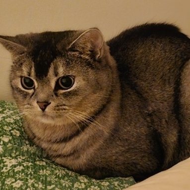
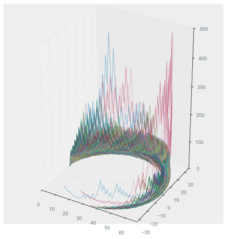
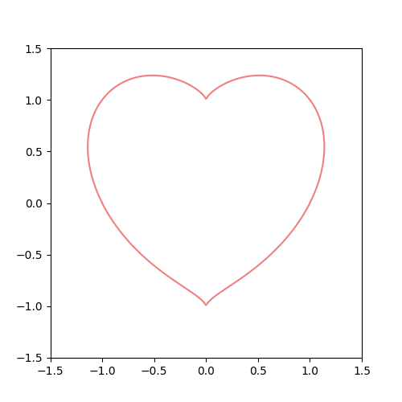

<h3>👋 Hi, 안녕하세요, I am TaeKyung Kwak | <a href="https://taery.blog/?utm_source=github&utm_medium=referral&utm_campaign=developer_profile">blog</a></h3>
<i>🇰🇷 SEOUL, KOREA</i> | 🐈‍⬛🐧 Cats, Linux, and other animals  

 <h3>🃏 Interests</h3>
  💻 Computer science | basics
  📊 Data & AI | Machine/Deep learning, LLM 
   Flutter | all platform UI/UX 
   Rust | modern memory & performance
  

> 📖 "There is no technology that surpasses nature. In fact, all technology imitates various aspects of nature." 
> — Meditations, Marcus Aurelius

🐳  Trying to understand the principles beyond just using libraries. 
🎼  Enjoy developing and want to learn and build many things.

       
    

