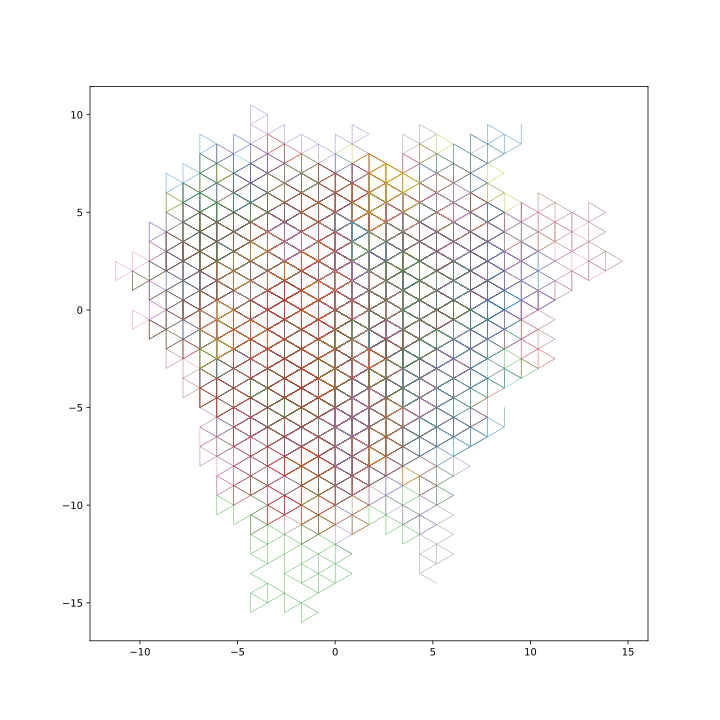

### 👋 Hi, I'm TaeKyung Kwak  
🇰🇷 Seoul, Korea | 🐧🐈 Cats, Linux, and other animals  

 

### ⭐️ Interests 
🦀 Rust — modern memory & performance  
📊 Data & AI — machine learning, statistics  
🚀 Flutter — cross-platform UI/UX  

⛳︎  I'm trying to understand the principles beyond just using libraries. 
👾  I truly enjoy developing and want to learn and build many things.

> 📝 *"There is no technology that surpasses nature. In fact, all technology imitates various aspects of nature."*  
> — *Meditations, Marcus Aurelius*

&nbsp;&nbsp;&nbsp;&nbsp;&nbsp;&nbsp;&nbsp;&nbsp;&nbsp;&nbsp;

