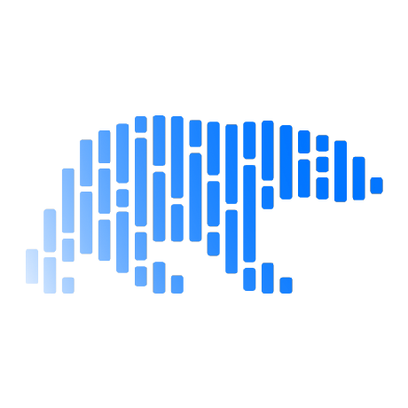

<h3>👋 Hi, 안녕하세요, I am TaeKyung Kwak  
<i>🇰🇷 Seoul, Korea</i> </h3>
 🐧🐈 Cats, Linux, and other animals 

 

 <h3>🃏 Interests</h3>
  📊 Data & AI — machine/deep learning, LLM 
   Flutter — all platform UI/UX 
   Rust — modern memory & performance

 

> 📖 "There is no technology that surpasses nature. In fact, all technology imitates various aspects of nature." 
> — Meditations, Marcus Aurelius

⛳︎  trying to understand the principles beyond just using libraries. 
🎼  enjoy developing and want to learn and build many things.

           

